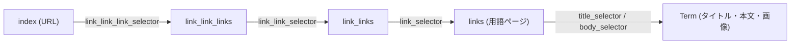
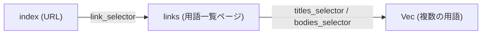
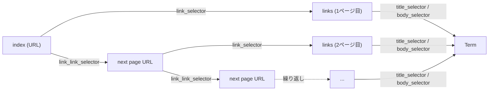

# Flow Types: FlowA, FlowB, FlowC

本プロジェクトでは、用語集サイトのスクレイピングパターンを3つの **Flow** 型として定義しています。  
すべての Flow は共通の `Flow` トレイトを実装し、以下の4つのメソッドを持ちます。

```rust
#[async_trait]
pub trait Flow {
    async fn get_link_link_links(&self) -> Vec<String>;
    async fn get_link_links(&self) -> Vec<String>;
    async fn get_links(&self) -> Vec<String>;
    async fn get_terms(&self) -> Vec<Term>;
}
```

---

## FlowA — 階層型リンク構造

最も利用されるパターンです。最大3段階のリンクをたどって用語詳細ページに到達します。

### データフロー



> **省略可能**: 上位のリンク階層は省略できます。  
> 例えば `link_link_link_selector` が空なら、`index` → `link_links` → `links` の2段階になります。  
> `link_links` を直接指定することもできます。

### フィールド一覧

| フィールド | 型 | 説明 |
|---|---|---|
| `index` | `&str` | 起点となるインデックスページの URL |
| `base` | `&str` | 相対 URL を解決するためのベース URL |
| `link_link_link_base` | `&str` | 3段目リンク専用のベース URL（空なら `base` を使用） |
| `link_link_base` | `&str` | 2段目リンク専用のベース URL（空なら `base` を使用） |
| `link_base` | `&str` | 1段目リンク専用のベース URL（空なら `base` を使用） |
| `link_link_link_selector` | `&str` | 3段目リンクの CSS セレクタ |
| `link_link_selector` | `&str` | 2段目リンクの CSS セレクタ |
| `link_selector` | `&str` | 用語ページへのリンクの CSS セレクタ |
| `title_selector` | `&str` | 用語タイトルの CSS セレクタ |
| `body_selector` | `&str` | 用語本文の CSS セレクタ |
| `image_selector` | `Option<&str>` | 画像の CSS セレクタ（任意） |
| `encoding` | `&str` | 文字エンコーディング（デフォルト: `utf-8`） |
| `link_link_links` | `Vec<String>` | 3段目リンクの直接指定（空なら自動取得） |
| `link_links` | `Vec<String>` | 2段目リンクの直接指定（空なら自動取得） |
| `links` | `Vec<String>` | 用語ページの URL の直接指定（空なら自動取得） |
| `pool_size` | `usize` | 並行リクエスト数（デフォルト: `50`） |
| `rest` | `u64` | チャンク間の待機秒数（デフォルト: `5`） |

### 使用例

```rust
// 2段階リンク: index → link_links → links → terms
FlowA {
    index: "https://example.com/glossary/",
    base: "https://example.com",
    link_link_selector: ".category-list > li > a",
    link_selector: ".term-list > li > a",
    title_selector: "h1.term-title",
    body_selector: ".term-body",
    ..Default::default()
}

// link_links を直接指定
FlowA {
    link_links: vec![String::from("https://example.com/glossary/")],
    link_selector: ".term-list > li > a",
    title_selector: "h1.term-title",
    body_selector: ".term-body",
    ..Default::default()
}
```

---

## FlowB — ページ集約型

1つのページ内に複数の用語（タイトルと本文）がまとまっているパターンです。  
用語が個別ページを持たず、一覧ページから一括取得します。

### データフロー



> **注意**: `link_selector` が空の場合、`index` 自体を用語一覧ページとして扱います。  
> `links` を直接指定することもできます。

### フィールド一覧

| フィールド | 型 | 説明 |
|---|---|---|
| `index` | `&str` | 起点の URL |
| `base` | `&str` | 相対 URL を解決するためのベース URL |
| `link_selector` | `&str` | 用語一覧ページへのリンクの CSS セレクタ（空なら `index` 自体が対象） |
| `titles_selector` | `&str` | **複数の**用語タイトルを一括取得する CSS セレクタ |
| `bodies_selector` | `&str` | **複数の**用語本文を一括取得する CSS セレクタ |
| `encoding` | `&str` | 文字エンコーディング（デフォルト: `utf-8`） |
| `links` | `Vec<String>` | 用語一覧ページの URL の直接指定 |

### 重要な違い: FlowA vs FlowB

- **FlowA**: 各用語ページから `get_term()` で **1つの Term** を取得
- **FlowB**: 各ページから `get_terms()` で **複数の Term** を一括取得  
  → `titles_selector` と `bodies_selector` は同数の要素にマッチする必要があります

### 使用例

```rust
// index ページから直接用語を取得
FlowB {
    index: "https://example.com/glossary/",
    titles_selector: "table > tbody > tr > td:nth-child(1)",
    bodies_selector: "table > tbody > tr > td:nth-child(2)",
    ..Default::default()
}

// 複数ページの URL を直接指定
FlowB {
    links: vec!["https://example.com/glossary/a".to_string()],
    titles_selector: ".term-title",
    bodies_selector: ".term-body",
    ..Default::default()
}
```

---

## FlowC — ページネーション型

ページネーション（「次のページ」リンク）をたどりながら用語リンクを収集するパターンです。  
主に、ページ数が不定で次ページリンクを順にたどる必要があるサイトに使われます。

### データフロー



### フィールド一覧

| フィールド | 型 | 説明 |
|---|---|---|
| `index` | `&str` | 起点の URL |
| `base` | `&str` | 相対 URL を解決するためのベース URL |
| `link_link_base` | `&str` | 2段目リンク専用のベース URL |
| `link_base` | `&str` | 1段目リンク専用のベース URL |
| `link_link_selector` | `&str` | **次ページ**へのリンクの CSS セレクタ |
| `link_selector` | `&str` | 用語ページへのリンクの CSS セレクタ |
| `title_selector` | `&str` | 用語タイトルの CSS セレクタ |
| `body_selector` | `&str` | 用語本文の CSS セレクタ |
| `image_selector` | `Option<&str>` | 画像の CSS セレクタ（任意） |
| `encoding` | `&str` | 文字エンコーディング（デフォルト: `utf-8`） |
| `link_link_links` | `Vec<String>` | 未使用（常に空を返す） |
| `link_links` | `Vec<String>` | 未使用（常に空を返す） |
| `links` | `Vec<String>` | 用語ページの URL の直接指定（空なら自動取得） |
| `pool_size` | `usize` | 並行リクエスト数（デフォルト: `50`） |
| `rest` | `u64` | チャンク間の待機秒数（デフォルト: `5`） |

### FlowA との違い

- **FlowA** の `link_link_selector` は、インデックスからカテゴリページへのリンクを表す
- **FlowC** の `link_link_selector` は、**次ページ**へのリンクを表す（ページネーション用）
- FlowC の `get_links()` は、次ページが見つからなくなるまでループで収集を続ける

### 使用例

```rust
FlowC {
    index: "https://example.com/glossary/list.html",
    base: "https://example.com",
    link_link_selector: "li.pagination__next > a",  // 次ページリンク
    link_selector: "li.term-card > a",               // 用語ページリンク
    title_selector: "#term-title",
    body_selector: ".term-description",
    pool_size: 10,
    rest: 240,
    ..Default::default()
}
```

---

## 比較まとめ

| 特徴 | FlowA | FlowB | FlowC |
|---|---|---|---|
| **典型的な用途** | 階層型リンクの用語集 | 1ページに複数用語がある用語集 | ページネーションのある用語集 |
| **リンク階層** | 最大3段階 | 0〜1段階 | ページネーションで動的 |
| **用語の取得方式** | 1ページ = 1用語 (`get_term`) | 1ページ = 複数用語 (`get_terms`) | 1ページ = 1用語 (`get_term`) |
| **並行リクエスト制御** | `pool_size` + `rest` | なし | `pool_size` + `rest` |
| **使用頻度** | 最多 | 中程度 | 少ない |

---

## 既存ドキュメントとの対応

[docs/README.md](./README.md) に記載されているスクレイピング方式との対応は以下の通りです。

| docs/README.md の分類 | 対応する Flow 型 |
|---|---|
| 1. 階層型リンク構造 | **FlowA** |
| 2. カテゴリページ集約型 | **FlowB** |
| 3. API利用型 | 該当なし（個別実装） |
| 4. 正規化されていないパターン | `handmade` モジュール（個別実装） |

> FlowC は README.md の分類に明示的には含まれていませんが、FlowA の変種としてページネーション対応に特化した型です。
